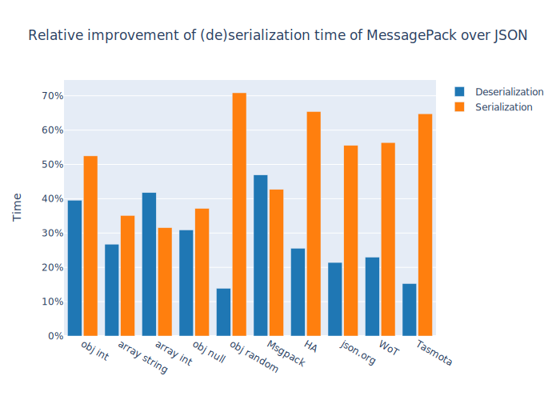

# Benchmark (de)serialization of Json and MessagePack using ArduinoJSON

A benchmark comparing the performance of JSON and MessagePack on different microcontrollers using [ArduinoJson](https://arduinojson.org/) library.

## Motivation

I hadn't been aware of [MessagePack](https://msgpack.org/index.html) until ArduinoJson, in v6, has introduced seamless support to it. Testing it was super easy: just one line change. So, given the claimed benefits of MessagePack over JSON, I decided to give it a try, leading me to develop this benchmark.

## Try yourself

### Install

Clone this repository.
You can compile this firmware with PlarformIO. Alternatively, you can use Arduino IDE. The only dependency is ArduinoJson and the Arduino Cores for your boards.

### Configure

The benchmark embed some JSONs, however you can add your JSONs. Just copy them in `input_json.h` and add an entry for each JSON in `items` array, at the beginning of `main.cpp`.

### Build and Compile

Select your target board and type `pio run -e <your_micro> -t upload` to compile and upload the firmware.

### Run

Open the serial monitor (`pio device monitor`). Press a key to run the benchmark. When it finishes, you can re-run it by pressing a key. Remember that the results may be affected by the cache after the first trial.

For each data object, you obtain the following data:

- deserialization time using JSON and MessagePack, in microseconds
- serialization time using JSON and MessagePack, in microseconds
- space occupied in serialized form in JSON and MessagePack, in bytes

#### Output example

The firmware prints the results of the benchmark on the serial port.
The results are presented in 2 versions: human-friendly and machine-friendly. The former is intended to have an immediate and readable output to check everything is working. The latter is a CSV summary containing only essential raw data, and it is ideal for further algorithmic analysis. Here an example:

    Benchmark of (de)serialization of JSON and MessagePack using ArduinoJson

    Benchmarking "short int", lenght:48byte, content: {"int1":0,"int2":2,"int3":3,"n...
    Serialization results
        MessagePack  time: 119us written:  35byte
        Json         time: 290us written:  48byte
      Serialization improvements over JSON
          time: -58.97% size: -27.08%
    Deserialization results
        MessagePack     time: 180us
        Json            time: 226us
      Deserialization improvements over JSON
          time: -20.35%

    Benchmarking "short json", lenght:27byte, content: {"compact":true,"schema":0}
    Serialization results
        MessagePack  time:  15us written:  18byte
        Json         time:  32us written:  27byte
      Serialization improvements over JSON
          time: -53.13% size: -33.33%
    Deserialization results
        MessagePack     time:  39us
        Json            time:  46us
      Deserialization improvements over JSON
          time: -15.22%

    Benchmarking "medium mixed", lenght:592byte, content: {"deviceState":{"battery":0,"f...
    Serialization results
        MessagePack  time: 225us written: 490byte
        Json         time: 610us written: 592byte
      Serialization improvements over JSON
          time: -63.11% size: -17.23%
    Deserialization results
        MessagePack     time: 1149us
        Json            time: 1446us
      Deserialization improvements over JSON
          time: -20.54%

    Benchmarking "long and mixed", lenght:1973byte, content: [{"_id":"5e70a2599fdb2683bf64f...
    Serialization results
        MessagePack  time: 656us written: 1718byte
        Json         time: 2166us written: 1970byte
      Serialization improvements over JSON
          time: -69.71% size: -12.79%
    Deserialization results
        MessagePack     time: 5301us
        Json            time: 6523us
      Deserialization improvements over JSON
          time: -18.73%

    Benchmarking "array strings", lenght:74byte, content: ["hello","world","testing","me...
    Serialization results
        MessagePack  time:  39us written:  58byte
        Json         time:  80us written:  74byte
      Serialization improvements over JSON
          time: -51.25% size: -21.62%
    Deserialization results
        MessagePack     time:  97us
        Json            time: 121us
      Deserialization improvements over JSON
          time: -19.83%

    Benchmarking "array int", lenght:45byte, content: [0,1,23212,3,2039394,5,6,71223...
    Serialization results
        MessagePack  time:  27us written:  25byte
        Json         time: 112us written:  45byte
      Serialization improvements over JSON
          time: -75.89% size: -44.44%
    Deserialization results
        MessagePack     time:  54us
        Json            time: 104us
      Deserialization improvements over JSON
          time: -48.08%

    Benchmarking "short null", lenght:13byte, content: {"null":null}
    Serialization results
        MessagePack  time:   9us written:   7byte
        Json         time:  14us written:  13byte
      Serialization improvements over JSON
          time: -35.71% size: -46.15%
    Deserialization results
        MessagePack     time:  24us
        Json            time:  24us
      Deserialization improvements over JSON
          time: 0.00%

    Benchmarking "mixed json.org", lenght:360byte, content: {"glossary":{"title":"example ...
    Serialization results
        MessagePack  time: 128us written: 304byte
        Json         time: 369us written: 360byte
      Serialization improvements over JSON
          time: -65.31% size: -15.56%
    Deserialization results
        MessagePack     time: 521us
        Json            time: 684us
      Deserialization improvements over JSON
          time: -23.83%

    Benchmarking "mixed json WoT", lenght:266byte, content: {"id":"https://mywebthingserve...
    Serialization results
        MessagePack  time:  92us written: 229byte
        Json         time: 275us written: 266byte
      Serialization improvements over JSON
          time: -66.55% size: -13.91%
    Deserialization results
        MessagePack     time: 341us
        Json            time: 443us
      Deserialization improvements over JSON
          time: -23.02%

    Benchmarking "mixed json Tasmota", lenght:1302byte, content: {"Status":{"Module":1,"Friendl...
    Serialization results
        MessagePack  time: 500us written: 1044byte
        Json         time: 1355us written: 1302byte
      Serialization improvements over JSON
          time: -63.10% size: -19.82%
    Deserialization results
        MessagePack     time: 4361us
        Json            time: 5325us
      Deserialization improvements over JSON
          time: -18.10%

    name,deserTimeJson,deserTimeMsgPack,serTimeJson,serTimeMsgPack,serSpaceJson,serSpaceMsgPack
    short int,226,180,290,119,48,35
    short json,46,39,32,15,27,18
    medium mixed,1446,1149,610,225,592,490
    long and mixed,6523,5301,2166,656,1970,1718
    array strings,121,97,80,39,74,58
    array int,104,54,112,27,45,25
    short null,24,24,14,9,13,7
    mixed json.org,684,521,369,128,360,304
    mixed json WoT,443,341,275,92,266,229
    mixed json Tasmota,5325,4361,1355,500,1302,1044

### Analyze

Copy and paste the CVS data into the dedicated folder (`data`). Then, open `data_analysis.ipynb` with Jupyter and add a reference to the file path and the MCU's name (more details in the notebook). Run the notebook which generates and exports the charts.

## My Benchmarks

At the time of writing, I had tested the benchmark on the following MCU/boards/core:

- ESP8266 / Lolin D1 Mini / Core: 3.0.0
- ESP32 / Lolin D32 / Core: 1.0.6
- ESP32-S2 / Espressif devkit / Core: 2.0.0-alpha1
- ESP32-C3 / Espressif devkit / Core: 2.0.0-alpha1
- SAMD21 / Arduino Nano 33 IoT / Core: 1.8.11
- RP2040 / Raspberry Pi RP2040 / Core: 2.1.0

using ArduinoJson 6.18.0. All the benchmarks are run with the default parameters (CPU frequency, flash frequency, optimization level, ...).
Ten different data objects, varying for length (up to 2000 bytes) and content, feed the benchmark to guarantee realistic results.

### Results

The following chart shows the improvements of (de)serialization execution time while using MessagePack over JSON.

The average improvement of deserialization is respectively 28.5% and 51.2%. The achievement is great, especially in serialization, where you easily save more than 50% of the time using real data objects (HA, json.org, WoT, and Tasmota).

The following chart shows the space saved while using MessagePack over JSON to serialize a data object.

On average, you will save 25.2%. Even if the improvement is considerable, with *real* JSON (HA, json.org, WoT, and Tasmota), it drops to about 15%. On the other hand, the best performing, namely `array int` and `obj null`, overpass 40%. However I expected it because integers and null values characterize such data objects, and binary protocols - by design - shine on those data types (`null` is not a data type, but it is equally optimized).

My initial purpose was to compare MessagePack over JSON. However, lately, I realized that MCUs do not proportionally equally perform while handling different data objects, which may interest you. So, the following chart is here to provide all the information you are looking for! It may seem a bit overstuffed, but it gives insights into MCU performance for each data object. Remember to not consider these scores as definitive and overall valid to evaluate an MCU since this benchmark runs too few high-level operations! For this purpose, you may consider instead dedicated benchmarks such as [CoreMark](https://www.eembc.org/coremark/) and [Dhrystone](https://en.wikipedia.org/wiki/Dhrystone).

You can immediately see that there isn't an absolute winner.
ESP32 is the MCU that wins most cases, while Arduino Nano 33 IoT is the slowest, especially on long and mixed data objects. Curiously, you can note that ESP32-C3 and ESP-S2 perform poorly on `obj null` and `MsgPack`, while they are excellent on the others. This shortcoming may be due to the core still in alpha release. I expect to see an improvement as the stable version will be released.
Finally, you can observe a shared performance pattern among the long and mixed data objects, while specific and shorter data objects seem to break any regularities. I suppose that short data objects may leverage particular optimizations of the underlying system (both hardware and software), leading to those sporadic performance differences.

Remember that the reported results may be affected by the version of Arduino Core and ArduinoJson library. So, always use the latest versions, or, if you want to check these results, install the *exact* version I reported for each component.

If you need to verify the performance of ArduinoJson for your application, I suggest extracting some real messages and run the benchmark on your target MCU.

If you would to see more charts or modity the existing one, run `data_analysis.ipynb` in Jupyter Notebook.

## Conclusions

MessagePack is a great format, and I suggest giving it a change in your next project. However, the performance improvements are not "incredible" (i.e., no more than double). So, you won't note any difference unless your application pushes the limit in terms of networking or local data storage. In this case, you may also consider more optimized protocols such as Protocol Buffers or FlatBuffer. However, remember they will require a more profound modification of your codebase, so weigh the costs and benefits of such change carefully.

For any questions or suggestions, let me know through Github Issues or drop me an email!
